# Role Context Manager - Visual Guide

**Plugin Version:** 1.7.0
**Last Updated:** 2026-02-09

This visual guide explains the role-context-manager plugin through diagrams organized by audience. Start with the section that matches your needs:

- **[For Non-Technical Users](#for-non-technical-users)**: Understand what the plugin does and why it matters
- **[For All Users](#for-all-users)**: Learn common workflows and commands
- **[For Engineers](#for-engineers)**: Dive into architecture and technical details

---

## For Non-Technical Users

### What Does This Plugin Do?

The role-context-manager plugin helps teams organize and share documentation based on their organizational structure and individual roles. Think of it as an intelligent filing system that knows what information each person needs.


**Key Benefits:**
- **For individuals**: Automatically load only the documents you need for your role
- **For teams**: Share consistent documentation standards across organizational levels
- **For organizations**: Scale documentation practices across company → product → project hierarchy

---

### How Teams Benefit

The plugin provides two powerful systems that work together:


**Path Configuration System**: Customize where configuration is stored (e.g., use `.myorg` instead of `.claude`)

**Hierarchical Organizations**: Support multi-level structures (company → system → product → project) with automatic inheritance

**Combined Power**: Use custom directory names in hierarchical structures seamlessly

---

## For All Users

### Getting Started: Basic Setup Workflow

This diagram shows the typical first-time setup experience:


**What happens:**
1. Initialize organizational template (one-time setup)
2. Set your role (tells plugin who you are)
3. Load context (brings relevant docs into your session)
4. Start working with automatic context on each session

---

### Hierarchical Organization Setup

For teams with multiple organizational levels (company → product → project):

```mermaid
%%{init: {'theme':'neutral'}}%%
graph TD
    Start[Start: Multi-level Organization] --> CheckRoot{Is this the<br/>root level?}

    CheckRoot -->|Yes| SetupCompany[Setup: Company Level]
    SetupCompany --> CompanyInit[/init-org-template]
    CompanyInit --> CompanyLevel[/set-org-level company]
    CompanyLevel --> CompanyRole[/set-role cto]
    CompanyRole --> CompanyDone[✓ Company level ready]

    CheckRoot -->|No| DetectParent{Can plugin detect<br/>parent?}

    DetectParent -->|Yes| AutoParent[Plugin finds parent automatically]
    DetectParent -->|No| ManualParent[Specify parent location]

    AutoParent --> SetupChild[Setup: Child Level]
    ManualParent --> SetupChild

    SetupChild --> ChildInit[/init-org-template]
    ChildInit --> ValidateRel{Valid parent-child<br/>relationship?}

    ValidateRel -->|No| Error[❌ Error: Invalid relationship]
    ValidateRel -->|Yes| FilterGuides[Plugin filters role guides]

    FilterGuides --> InheritNote[Guides inherited from parent:<br/>No duplication needed]
    InheritNote --> ChildLevel[/set-org-level project]
    ChildLevel --> ChildRole[/set-role software-engineer]
    ChildRole --> ChildDone[✓ Child level ready]

    ChildDone --> MoreLevels{More levels<br/>to setup?}
    MoreLevels -->|Yes| CheckRoot
    MoreLevels -->|No| Complete[✓ Hierarchy complete]

    style Start fill:#c9f,stroke:#333,stroke-width:2px,color:#000
    style CompanyDone fill:#8d8,stroke:#333,stroke-width:2px,color:#000
    style ChildDone fill:#8d8,stroke:#333,stroke-width:2px,color:#000
    style Complete fill:#8d8,stroke:#333,stroke-width:2px,color:#000
    style Error fill:#d88,stroke:#333,stroke-width:2px,color:#000
    style InheritNote fill:#fc8,stroke:#333,stroke-width:2px,color:#000
```

**Key Points:**
- **Parent Detection**: Plugin automatically finds parent organizations
- **Inheritance**: Child levels inherit role guides from parents (no duplication)
- **Validation**: Only valid parent-child relationships allowed
- **Filtering**: Templates apply only appropriate guides for each level

**Valid Relationships:**
- Company can parent: System, Product, or Project
- System can parent: Product or Project
- Product can parent: Project
- Project cannot parent anything (leaf node)

---

### Custom Path Configuration

Choose when and how to customize directory names:


**Configuration Priority** (highest to lowest):
1. **Environment Variables**: `RCM_CLAUDE_DIR_NAME`, `RCM_ROLE_GUIDES_DIR`
2. **Local Manifest**: `./<claude-dir>/paths.json`
3. **Global Manifest**: `$HOME/<claude-dir>/paths.json`
4. **Default Values**: `.claude` and `role-guides`

---

### Role Loading Sequence

What happens when you load your role context:

```mermaid
sequenceDiagram
    actor User
    participant CMD as /load-role-context
    participant LD as Level Detector
    participant HD as Hierarchy Detector
    participant RM as Role Manager
    participant FS as File System
    participant Session as Claude Session

    User->>CMD: Execute command

    CMD->>LD: Detect organizational level
    LD->>FS: Read organizational-level.json
    FS-->>LD: level: "project"
    LD-->>CMD: Current level: project

    CMD->>HD: Find parent organizations
    HD->>FS: Scan directory tree upward
    FS-->>HD: Found: parent at ../product/.claude
    HD->>FS: Read parent level
    FS-->>HD: parent_level: "product"
    HD-->>CMD: Parent hierarchy established

    CMD->>RM: Get user role
    RM->>FS: Read preferences.json
    FS-->>RM: user_role: "software-engineer"
    RM-->>CMD: Role: software-engineer

    CMD->>RM: Load role guide
    RM->>FS: Read role-guides/software-engineer-guide.md
    FS-->>RM: [Guide content with document references]

    CMD->>RM: Extract document references
    RM-->>CMD: Documents: [/engineering-standards.md, ...]

    CMD->>HD: Filter by inheritance
    HD-->>CMD: Include: [project-level docs]<br/>Exclude: [parent-level docs - inherited]

    loop For each document
        CMD->>FS: Check if document exists
        FS-->>CMD: Status: exists/missing
    end

    CMD->>FS: Read all existing documents
    FS-->>CMD: [Document contents]

    CMD->>Session: Inject role guide into context
    CMD->>Session: Inject all documents into context

    CMD->>User: ✓ Context loaded: software-engineer (5 documents)

    Note over Session: Claude now has role-specific<br/>context for this session
```



**What Gets Loaded:**
1. Your role guide (defines what you do)
2. Documents referenced in the role guide
3. Custom additions you've specified
4. Minus any custom removals
5. **Inherited guides from parent levels automatically available**

---

### Available Commands

Commands are organized by purpose with typical usage sequences:


**Command Sequences:**

**First-Time Setup:**
1. `/init-org-template` → Initialize framework
2. `/set-org-level` → Set organizational level (if not detected)
3. `/set-role` → Set your role
4. `/load-role-context` → Load context into session

**Daily Usage:**
- `/load-role-context` → Automatically runs on session start
- `/show-role-context` → Check what's loaded
- `/validate-setup` → Verify configuration health

**Customization:**
- `/update-role-docs +path/to/doc.md` → Add document
- `/update-role-docs -/doc.md` → Remove document
- `/init-role-docs --reset` → Reset to defaults

**Hierarchical Setup:**
1. `/configure-paths --global` → Set custom paths (optional)
2. `/init-org-template` (at company level)
3. `/init-org-template` (at product level) → Auto-detects parent
4. `/add-role-guides` → Add level-specific guides

---

## For Engineers

### System Architecture

The plugin is organized in layers with clear dependencies:

```mermaid
%%{init: {'theme':'neutral'}}%%
graph TB
    subgraph Application["Application Layer"]
        CMD[Commands<br/>/set-role, /load-role-context, etc.]
        AGT[Agents<br/>template-setup-assistant<br/>framework-validator<br/>document-generator<br/>role-guide-generator<br/>template-sync]
    end

    subgraph Orchestration["Orchestration Layer"]
        RM[role-manager.sh<br/>Role & context management]
        LD[level-detector.sh<br/>Level detection & prompting]
        TM[template-manager.sh<br/>Template operations]
    end

    subgraph Core["Core Systems Layer"]
        PC[path-config.sh<br/>API: get_claude_dir_name()<br/>API: get_role_guides_dir()<br/>API: get_full_claude_path()<br/>Configuration caching<br/>Security validation]

        HD[hierarchy-detector.sh<br/>API: find_parent_claude_dirs()<br/>API: get_nearest_parent()<br/>API: build_hierarchy_path()<br/>API: is_valid_child_level()<br/>Inheritance logic<br/>Level-based filtering]
    end

    subgraph Storage["Storage Layer"]
        JSON[JSON Configuration<br/>preferences.json<br/>organizational-level.json<br/>paths.json<br/>role-references.json]
        DOCS[Documents<br/>Role guides<br/>Organizational docs<br/>Templates]
        FS[File System Operations]
    end

    %% Application dependencies
    CMD --> RM
    CMD --> LD
    CMD --> TM
    AGT --> RM
    AGT --> TM
    AGT --> LD

    %% Orchestration dependencies
    RM --> PC
    RM --> HD
    LD --> PC
    LD --> HD
    TM --> PC
    TM --> HD

    %% Core dependencies
    HD --> PC

    %% Storage dependencies
    PC --> FS
    HD --> FS
    RM --> JSON
    RM --> DOCS
    TM --> DOCS

    FS --> JSON
    FS --> DOCS

    %% Styling
    style Application fill:#9cf,stroke:#333,stroke-width:2px,color:#000
    style Orchestration fill:#fc8,stroke:#333,stroke-width:2px,color:#000
    style Core fill:#c9f,stroke:#333,stroke-width:2px,color:#000
    style Storage fill:#8d8,stroke:#333,stroke-width:2px,color:#000

    style PC fill:#8cf,stroke:#333,stroke-width:2px,color:#000
    style HD fill:#8cf,stroke:#333,stroke-width:2px,color:#000
```

**Key Design Principles:**

1. **Single Source of Truth**: `path-config.sh` is the authority for all path resolution
2. **Dependency Flow**: `hierarchy-detector.sh` depends on and uses `path-config.sh`
3. **Dynamic Resolution**: All paths resolved at runtime, never hardcoded
4. **Separation of Concerns**: Each layer has clear responsibilities
5. **Backward Compatibility**: Default behavior identical to pre-v1.6.0 versions

**Component Responsibilities:**

**Application Layer:**
- User-facing commands and intelligent agents
- Invoke orchestration layer for business logic
- No direct file system access

**Orchestration Layer:**
- Business logic for role, level, and template management
- Coordinates between core systems
- Uses core system APIs exclusively

**Core Systems Layer:**
- `path-config.sh`: Directory name resolution (foundation)
- `hierarchy-detector.sh`: Organizational hierarchy (uses path-config)
- Both provide public APIs for upper layers

**Storage Layer:**
- File system operations
- JSON configuration files
- Document and template storage

---

### Configuration Resolution Flowchart

How the plugin determines which directory names to use:

```mermaid
%%{init: {'theme':'neutral'}}%%
graph TD
    Start[Plugin needs directory name] --> LoadConfig{Configuration<br/>cached?}

    LoadConfig -->|Yes| UseCache[Use cached configuration]
    LoadConfig -->|No| CheckEnv

    CheckEnv{Environment<br/>variable set?}

    CheckEnv -->|Yes: RCM_CLAUDE_DIR_NAME| ValidateEnv[Validate environment value]
    CheckEnv -->|No| CheckLocal

    ValidateEnv --> EnvValid{Valid?}
    EnvValid -->|Yes| UseEnv[Use environment value]
    EnvValid -->|No| Error1[❌ Error: Invalid value]

    CheckLocal{Local paths.json<br/>exists?}

    CheckLocal -->|Yes| ReadLocal[Read ./<claude-dir>/paths.json]
    CheckLocal -->|No| CheckGlobal

    ReadLocal --> LocalValid{Valid JSON<br/>& values?}
    LocalValid -->|Yes| UseLocal[Use local manifest]
    LocalValid -->|No| Error2[❌ Error: Invalid manifest]

    CheckGlobal{Global paths.json<br/>exists?}

    CheckGlobal -->|Yes| ReadGlobal["Read $HOME/<claude-dir>/paths.json"]
    CheckGlobal -->|No| UseDefault

    ReadGlobal --> GlobalValid{Valid JSON<br/>& values?}
    GlobalValid -->|Yes| UseGlobal[Use global manifest]
    GlobalValid -->|No| Error3[❌ Error: Invalid manifest]

    UseDefault[Use default values<br/>.claude + role-guides]

    UseEnv --> Cache
    UseLocal --> Cache
    UseGlobal --> Cache
    UseDefault --> Cache
    UseCache --> Return

    Cache[Cache configuration] --> Return[Return directory name]

    Error1 --> Fallback
    Error2 --> Fallback
    Error3 --> Fallback

    Fallback[Fall back to defaults<br/>Log warning] --> Return

    Return --> Validate{Security<br/>validation}

    Validate -->|Pass| Done[✓ Directory name ready]
    Validate -->|Fail| SecurityError[❌ Error: Security violation]

    style Start fill:#c9f,stroke:#333,stroke-width:2px,color:#000
    style Done fill:#8d8,stroke:#333,stroke-width:2px,color:#000
    style Error1 fill:#d88,stroke:#333,stroke-width:2px,color:#000
    style Error2 fill:#d88,stroke:#333,stroke-width:2px,color:#000
    style Error3 fill:#d88,stroke:#333,stroke-width:2px,color:#000
    style SecurityError fill:#d88,stroke:#333,stroke-width:2px,color:#000
    style Cache fill:#fc8,stroke:#333,stroke-width:2px,color:#000
```



**Configuration Priority** (highest to lowest):
1. **Cache**: Previous resolution (within same script execution)
2. **Environment Variables**: `RCM_CLAUDE_DIR_NAME`, `RCM_ROLE_GUIDES_DIR`
3. **Local Manifest**: `./<claude-dir>/paths.json` in current directory
4. **Global Manifest**: `$HOME/<claude-dir>/paths.json`
5. **Default Values**: `.claude` and `role-guides`

**Security Validation Rules:**
- Alphanumeric characters, dots, hyphens, underscores only
- No path traversal sequences (`..`)
- No absolute paths (no leading `/`)
- No spaces or special characters
- Maximum length: 100 characters

**Performance Characteristics:**
- Configuration load: <10ms (first call)
- Cached resolution: <1ms (subsequent calls)
- Cache memory: <1KB
- Cache invalidation: On configuration change

---

### Technical Details: Integration Architecture

How the two core systems work together:


**Integration Points:**

1. **Source Order Dependency**:
   - All scripts source `path-config.sh` BEFORE `hierarchy-detector.sh`
   - `hierarchy-detector.sh` requires path-config functions to be available
   - Enforced in all command and agent scripts

2. **Refactoring Details** (v1.7.0):
   - Removed 30+ hardcoded `.claude` references from hierarchy-detector.sh
   - Replaced with `get_claude_dir_name()` API calls
   - All hardcoded `role-guides` replaced with `get_role_guides_dir()`
   - Parent detection now works with any configured directory names

3. **Function Call Pattern**:
   ```bash
   # In hierarchy-detector.sh
   local claude_dir_name
   claude_dir_name="$(get_claude_dir_name)" || return 1

   # Use dynamically resolved name
   if [[ -d "$dir/$claude_dir_name" ]]; then
       parent_dirs+=("$dir/$claude_dir_name")
   fi
   ```

4. **Combined Overhead**:
   - Path configuration: <10ms load
   - Hierarchy detection: <100ms for 5-level hierarchy
   - Total combined: <200ms (meets performance target)
   - 90%+ cache hit rate in typical workflows

**Backward Compatibility Guarantee:**
- Without configuration: Uses `.claude` and `role-guides` (v1.0.0 behavior)
- With path-config only: Custom paths work (v1.6.0 behavior)
- With hierarchy only: Hierarchy works with `.claude` (v1.5.0 behavior)
- With both: Full integration (v1.7.0 behavior)
- No breaking changes to any public APIs

---

## Appendix

### Diagram Legend

**Colors:**
- 🔵 **Blue**: User actions, commands, interactions
- 🟢 **Green**: Successful outcomes, validation passed
- 🟠 **Orange**: Configuration, settings, decisions
- 🟣 **Purple**: Inheritance, hierarchy, relationships
- 🔴 **Red**: Errors, validation failures, warnings
- 🟡 **Yellow**: Notes, important information

**Arrow Types:**
- **Solid arrows** (→): Direct execution flow, function calls
- **Dotted arrows** (⋯→): Suggested sequences, typical usage patterns
- **Dependencies** (⋯→): Component dependencies, "uses" relationships

**Node Shapes:**
- **Rectangle**: Process, action, component
- **Diamond**: Decision point, conditional
- **Rounded rectangle**: Start/end point
- **Parallelogram**: Input/output operation
- **Cylinder**: Data storage

### Related Documentation

**Getting Started:**
- [README.md](README.md) - Main plugin documentation
- [CHEATSHEET.md](CHEATSHEET.md) - Quick command reference

**Feature Guides:**
- [Path Configuration](docs/PATH-CONFIGURATION.md) - Customizable directory names
- [Hierarchical Organizations](docs/HIERARCHICAL-ORGANIZATIONS.md) - Multi-level structures
- [Combined Features](docs/COMBINED-FEATURES.md) - Using both features together
- [SCOPES.md](SCOPES.md) - Global and project configuration

**Advanced:**
- [CLAUDE.md](CLAUDE.md) - Complete architecture documentation (for AI)
- [TEMPLATES.md](TEMPLATES.md) - Template system details
- [CHANGELOG.md](CHANGELOG.md) - Complete version history

**Commands:**
- [commands/](commands/) - Individual command documentation

### Version Information

**Plugin Version:** 1.7.0
**Release Date:** 2026-02-06
**Major Features:**
- Path Configuration System (v1.6.0)
- Hierarchical Organizations (v1.5.0)
- Integrated Release (v1.7.0)

**Compatibility:**
- Requires: Claude Code (latest), bash >=4.0, jq >=1.6
- Backward compatible with all v1.0.0+ configurations

### Quick Reference: Most Common Workflows

**Workflow 1: Individual Developer (Global Config)**
```bash
/init-org-template --global
/set-role software-engineer --global
# Works everywhere, automatic context loading
```

**Workflow 2: Team Project (Project Config)**
```bash
cd team-project
/init-org-template --project
/set-role qa-engineer --project
git add .claude/
git commit -m "Add team configuration"
```

**Workflow 3: Hierarchical Organization**
```bash
# Company level
cd /company-root
/init-org-template
/set-org-level company
/set-role cto

# Product level (child)
cd /company-root/product-a
/init-org-template  # Auto-detects parent
/set-org-level product
/set-role product-manager

# Project level (grandchild)
cd /company-root/product-a/project-x
/init-org-template  # Inherits from parents
/set-org-level project
/set-role software-engineer
```

**Workflow 4: Custom Paths**
```bash
# Configure globally
/configure-paths --global --claude-dir=.myorg --role-guides-dir=guides

# Use everywhere
cd any-project
/init-org-template  # Creates .myorg/ with guides/
```

**Workflow 5: Migration**
```bash
# Preview migration
/configure-paths --dry-run --migrate .claude .myorg

# Execute migration (preserves hierarchy)
/configure-paths --migrate .claude .myorg
```

---

**Need Help?**
- Run `/validate-setup` to check your configuration
- See [README.md](README.md) for detailed documentation
- Report issues: https://github.com/WAdamBrooksFS/role-context-manager-marketplace/issues

---

*This visual guide is part of the role-context-manager plugin v1.7.0*
*Generated: 2026-02-09*
*License: MIT*
